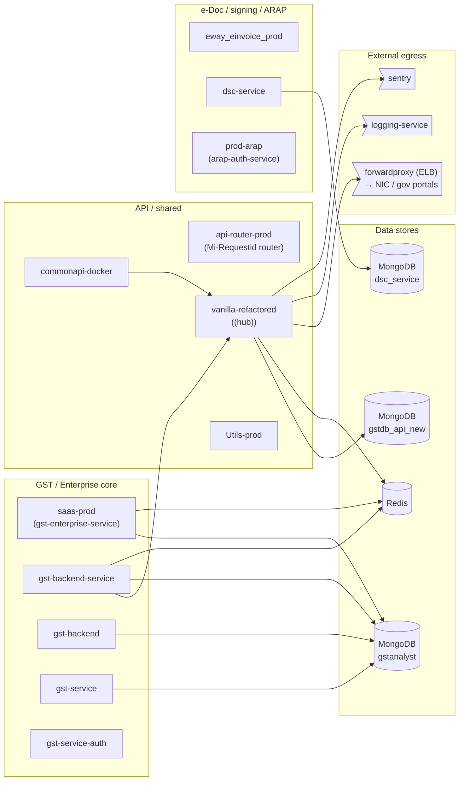
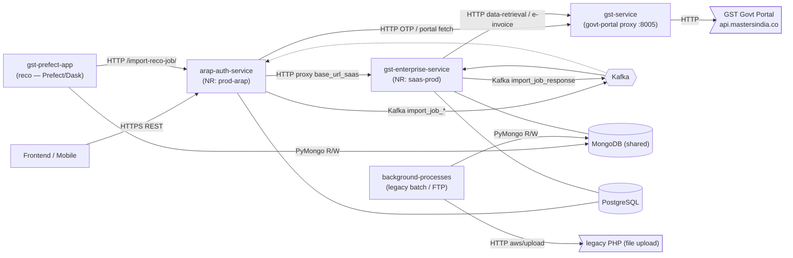

# Platform topology — observed from New Relic

The application topology in two layers: **observed** (what the platform *actually did*, from
New Relic telemetry) and **intended** (what the code wires up, from `architecture.md`). NR sees
the datastore + egress edges but is blind to most service→service hops; the code doc has the
service→service spine but not live traffic. Together they're the full picture — and the gap
between them (NR reports **15 apps**; the code doc models **5**) is itself a finding (see
*Name reconciliation*).

**Provenance:** New Relic account (via `NEWRELIC_API_KEY`, the same path `newrelic.py` uses).
`Span` window = **last 7 days**. Mined 2026-08-03. **PII-safe by construction:** every edge is
built from *host-level* attributes (`db.system`, `db.instance`, `server.address`) only — never
`http.url` / `request.uri`, which carry GSTINs/doc numbers. Regenerate with the queries in
*How this was built*.

---

## The map — observed (New Relic, 7d)

Two structural facts jump out:
- **`gstanalyst` (MongoDB) is the shared data hub** — `saas-prod`, `gst-backend-service`,
  `gst-service`, and `gst-backend` all read/write it. A schema or load problem there is a
  blast-radius-4 event.
- **`vanilla-refactored` is the busiest node** — heaviest DB + Redis traffic, the common
  downstream of `commonapi-docker` and `gst-backend-service`, and the only service with a
  well-instrumented **external egress** (through the `forwardproxy` ELB → NIC/gov portals).

---

## The map — intended (code, from `architecture.md`)

This is the service→service spine NR can't see: the request path and the async Kafka
round-trip. Node labels carry the NR appName where we've confirmed it.

**Intended edges (code-derived):**

| from | to | how | what |
|---|---|---|---|
| frontend | arap-auth-service | HTTPS REST | single entry point for all clients |
| arap-auth-service | gst-enterprise-service | HTTP proxy (`base_url_saas`) | all GSTR-3B / data-retrieval / reco / import-log endpoints |
| arap-auth-service | gst-enterprise-service | Kafka `import_job_gstr1/2`, `_einvoice`, `_eway` | async import submit |
| gst-enterprise-service | arap-auth-service | Kafka `import_job_response` | arap updates `ImportJob` status in PG |
| arap-auth-service | gst-service | HTTP (`GST_BACKEND_BASE_URL`) | OTP auth, GSTR portal fetch, captcha |
| gst-enterprise-service | gst-service | HTTP (`SAAS_BACKEND_URL`) | portal data retrieval, e-invoice signing |
| gst-service | GST Govt Portal | HTTP | the actual government API |
| gst-prefect-app | arap-auth-service | HTTP `POST /import-reco-job/` | submit reco connector jobs |
| gst-prefect-app | MongoDB | direct PyMongo | same collections as enterprise |
| background-processes | MongoDB / legacy PHP | PyMongo + HTTP `aws/upload` | FTP/EDI batch |

---

## Name reconciliation (code service ↔ New Relic appName)

The two layers don't line up 1:1, and that's the most actionable finding here.

| code service (`architecture.md`) | NR appName | confidence |
|---|---|---|
| arap-auth-service | `prod-arap` | **confirmed** (memory + NR error counts) |
| gst-enterprise-service | `saas-prod` | **confirmed** |
| gst-service (govt proxy) | `gst-service` | likely (name match) — unverified |
| gst-prefect-app | — | not mapped (appName unknown; cron-like) |
| background-processes | — | not instrumented in NR (cron/multiprocessing) |
| — | `vanilla-refactored` | **UNMAPPED** — the busiest NR node, not named in the code doc |
| — | `gst-backend`, `gst-backend-service` | **UNMAPPED** — extra GST apps; likely enterprise components/deploys |
| — | `commonapi-docker`, `Utils-prod`, `gst-service-auth`, `eway_einvoice_prod`, `dsc-service`, `mi-blog-backend` | other/unmapped |

**Finding worth chasing:** NR reports **15 reporting apps** but `architecture.md` models only
**5 logical services**. The biggest unknown is **`vanilla-refactored`** — busiest node, owns the
separate `gstdb_api_new` Mongo and the `forwardproxy` egress, is the common downstream of
`commonapi-docker` and `gst-backend-service`, yet appears nowhere in the code architecture. Two
observed edges (`gst-backend-service → vanilla-refactored`, `commonapi-docker → vanilla-refactored`)
suggest it's a core shared/API layer. Identifying which repo `vanilla-refactored`, `gst-backend`,
and `gst-backend-service` map to would close the observed↔intended gap — a good next indexing task.

---

## Services (15 APM entities reporting)

| group | services |
|---|---|
| GST / Enterprise core | `saas-prod` (=gst-enterprise-service), `gst-backend-service`, `gst-backend`, `gst-service`, `gst-service-auth` |
| API / shared | `api-router-prod` (Mi-Requestid router), `commonapi-docker`, `vanilla-refactored`, `Utils-prod` |
| e-Doc / signing / ARAP | `eway_einvoice_prod`, `dsc-service`, `prod-arap` (=arap-auth-service) |
| other / test | `mi-blog-backend`, `new-api-upgrade-test`, `new-api-upgrade-sandbox-test` |

## Service → datastore (observed, 7d)

| service | store | instance | calls (7d) |
|---|---|---|---|
| vanilla-refactored | Redis | — | 17.7M |
| vanilla-refactored | MongoDB | gstdb_api_new | 7.68M |
| gst-backend-service | MongoDB | **gstanalyst** | 929K |
| saas-prod | MongoDB | **gstanalyst** | 102K |
| dsc-service | MongoDB | dsc_service | 4.95K |
| gst-backend-service | Redis | — | 4.84K |
| gst-service | MongoDB | **gstanalyst** | 1.41K |
| saas-prod | Redis | — | 317 |
| gst-backend | MongoDB | **gstanalyst** | 157 |

## Service → external egress (observed, 7d)

| service | host | calls (7d) |
|---|---|---|
| vanilla-refactored | logging-service.mastersindia.co | 13.1M |
| vanilla-refactored | forwardproxy ELB (→ NIC / gov / external) | 6.95M |
| vanilla-refactored | sentry.mastersindia.co | 35.2K |

## Service → service (NR entity `CALLS`)

| caller | callee |
|---|---|
| commonapi-docker | vanilla-refactored |
| gst-backend-service | vanilla-refactored |
| NIC Healthcheck (monitor) | vanilla-refactored |
| ARAP Service | prod-arap (self-alias) |

---

## Limitations (read before trusting the service→service edges)

- **NR's service-to-service linkage is thin here** — only the 4 `CALLS` edges above exist in
  the entity graph, and `peer.hostname` / `request.header.Host` on spans are unpopulated, so
  most inter-service hops are **not** visible to New Relic distributed tracing. This is the same
  gap that makes the platform rely on the **Mi-Requestid** log-correlation (`trace_request`)
  for real cross-service request flow — that spine (Router → services → NIC) is **not**
  reconstructable from Span data; it lives in logs.
- Egress is only well-instrumented on `vanilla-refactored`; other services almost certainly
  call NIC/gov/each-other but don't emit host attributes on their spans.
- Datastore/egress **call counts** reflect the 7-day window and normal traffic skew, not
  importance per se.
- For the **intended** service→service graph (routes, ownership, boundaries), see *The map —
  intended* above (from `architecture.md`); the NR layer is its *observed* complement. Where
  the two disagree, trust NR for "what ran" and the code for "what's wired".

## How this was built (regenerate)

NerdGraph over `https://api.newrelic.com/graphql`, key from `.env`:
- **Inventory:** `entitySearch(query: "domain = 'APM'")` → 15 apps.
- **Service→service:** `entities(guids:[…]) { relatedEntities(filter:{relationshipTypes:{include:[CALLS]}}) }`.
- **Service→datastore:** `SELECT count(*) FROM Span WHERE category='datastore' FACET appName, db.system, db.instance SINCE 7 days ago`.
- **Service→external:** `SELECT count(*) FROM Span WHERE category='http' AND span.kind='client' FACET appName, server.address SINCE 7 days ago`.
- Service key is **`appName`** / `entity.name` (`service.name` is empty on these spans). Only
  host-level facets are used — never `http.url`/`request.uri` — so no customer PII is queried.
